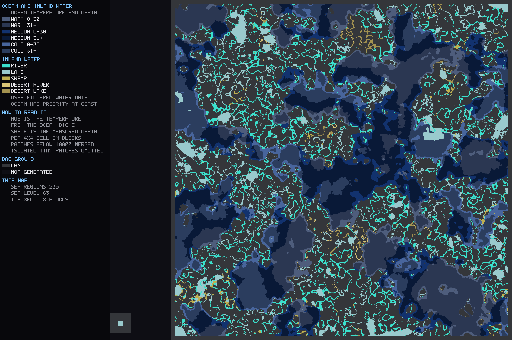
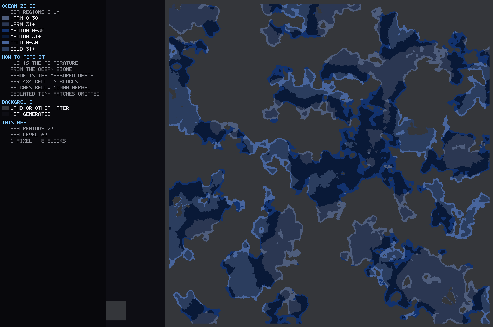
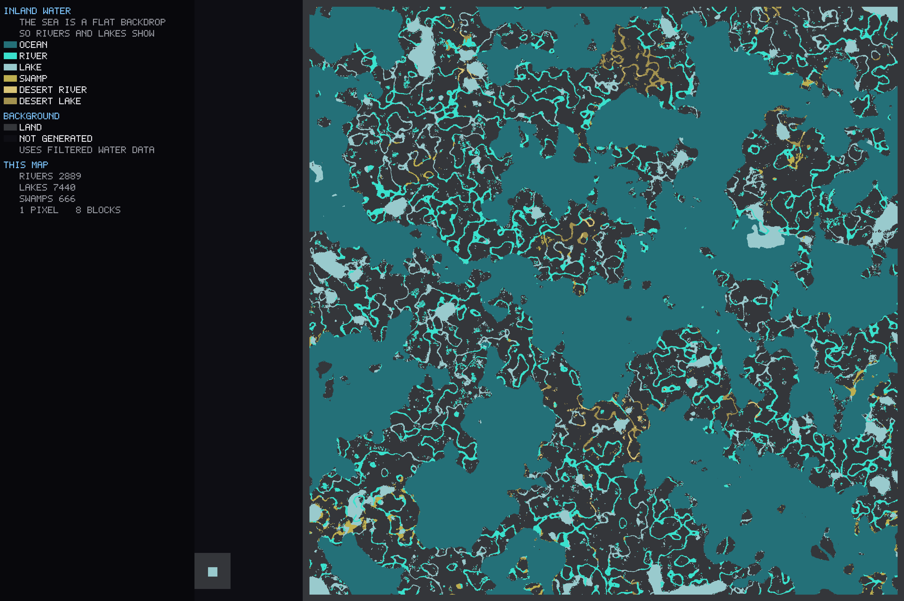

# Minecraft Water Map Generator (Rust)

A fast, offline **Minecraft Java water map generator and world analyzer** written
in Rust. Scan Anvil region files to classify **oceans, rivers, lakes, swamps and
cave water**, generate PNG maps, and export compact water-region data for Java
plugins and other tools. Supports vanilla and datapack biomes, including Terralith.

## Sample maps

These examples show the same Minecraft world at eight blocks per pixel. Click an
image for the full-size PNG. The combined map gives ocean zones priority at the coast.
These samples use source water only with `--max-below-sea-level 10
--min-river-merge 5000 --min-sea-merge 10000`. At sea level 63, water surfaces at
Y=53 or above are retained, including rivers under mountains. Lower water surfaces
and flowing/falling water are excluded before classification. This export contains
11,230 regions (235 seas, 2,889 rivers, 7,440 lakes and 666 swamps). The scan retains
19,607,677 covered water columns above the cutoff. All 151 tests and 65 binary
lookup round trips pass. This height rule also keeps shallow covered ponds; it
does not attempt to distinguish those from mountain passages by sky exposure.

### Combined ocean, river and lake map



<details>
<summary>Ocean temperature and depth map</summary>



</details>

<details>
<summary>River, lake and swamp map</summary>



</details>

## Build and run

Install the Rust toolchain, then build the command-line tool:

```bash
git clone https://github.com/VonNekyia/minecraft-water-map-generator.git
cd minecraft-water-map-generator
cargo build --release
cargo run --release -- --world "/path/to/minecraft/world" --output ./generated --export-map --max-below-sea-level 10
```

Replace the world path with a Minecraft Java world folder containing `region/`
and `level.dat`. Use a stopped world or a consistent backup for a reproducible
scan. The executable is `target/release/water-analyzer` (or `water-analyzer.exe`
on Windows). It reads the world and writes its results to the output directory.
World files are not included in this repository.

The runtime output, `water_regions.bin`, describes classified bodies of water:

```text
Minecraft world files
        |
   water-analyzer            (Rust, offline, parallel)
        |
   water_regions.bin         (compact, versioned, Java-friendly)
        |
   Java plugins              (fishing, ships, ... - gameplay lives here)
```

The tool is a **geographic preprocessor only**. It answers:

* Where is water?
* What kind of water is it? (`sea`, `river`, `lake`, `swamp`)
* How warm is it? (`warm`, `medium`, `cold`, from the biome)
* How vegetated is it? (`none`, `sparse`, `normal`, `jungle`)
* How deep is it? (`shallow`, `normal`, `deep`, measured surface to floor)
* Can it see the sky, or is it under a roof?
* What is special about it? (`ice`, `corals`, `desert`, `mangrove`, `cave`)

It does not know about fish, loot, rarity, ships, trading or any other gameplay
concept, and it must stay that way. Consumers read the same neutral data and make
their own decisions.

## Which water counts

Ordinary `minecraft:water` counts only with `Properties.level=0` (source water).
Levels 1-15 (flowing and falling water), the `flowing_water` block name, and
water states with missing or invalid levels are excluded. Waterlogged blocks,
kelp, seagrass and bubble columns continue to count as water-containing blocks.
This can break a connection made solely by a waterfall or flowing stream.

Use `--max-below-sea-level 10`, as in the examples, to retain water whose
**topmost water block Y is at least `sea_level - 10`**. At sea level 63 this means
Y=53 is included and Y=52 is excluded. The cutoff applies to each column before
4x4 averaging, region connectivity or merging. It uses the water surface, not the
seabed: deep oceans keep their full depth measurements.

This mode searches beneath terrain and keeps covered rivers and other qualifying
water at or above the cutoff. Retained covered water participates in normal
biome/shape classification and is shown in the maps; it is not forced into the
`cave` lake class or hidden merely because it has a roof. Height alone also keeps
any shallow underground pond above the cutoff. The scanner first detects sea
level from exposed water, then rescans with the height rule. `--sea-level` can
override the detected level.

`--no-caves` is a separate, stricter option that excludes **all** covered water,
including rivers through mountains. It cannot be combined with the height rule.
With neither option, the original cave scan and cave-modifier classification are
available. Flowing water is excluded in every mode. Ice, snow and lily pads remain
recognized as surface covers.

## Usage

```bash
water-analyzer --world "./server/world" --output "./generated" --max-below-sea-level 10
```

Options:

| flag | meaning |
|------|---------|
| `--world <dir>` | world folder containing `region/` and `level.dat` |
| `--output <dir>` | output directory, default `./generated` |
| `--threads <n>` | worker threads, default = logical CPUs |
| `--debug` | extra technical logging (largest regions, unknown biomes, index size) |
| `--export-json` | also write `debug/water_regions.json` |
| `--json-limit <n>` | export only the N largest regions to JSON |
| `--export-map` | also write the six debug PNGs (classification, regions, depth, oceans, inland, combined) |
| `--map-scale <n>` | blocks per pixel in the debug maps, default 8 |
| `--sea-level <y>` | override the detected sea level |
| `--min-water-body <n>` | minimum retained water-region area, default 200 columns; final pieces below it are dropped |
| `--min-river-merge <n>` | merge river regions smaller than N columns into adjoining rivers, default 5000; 0 disables this extra pass |
| `--min-sea-merge <n>` | merge actual sea regions smaller than N columns into adjoining sea regions, default 0 (off) |
| `--ocean-map-min-area <n>` | minimum ocean colour-patch area in the overview, default 10000; 0 disables the visual sieve |
| `--max-below-sea-level <n>` | retain water surfaces at or above sea level minus N, including covered rivers; off unless specified |
| `--no-caves` | skip all water that cannot see the sky; incompatible with the height rule |
| `--min-cave-body <n>` | smallest cave pool to report; defaults to `--min-water-body` |
| `--min-sea-body <n>` | connected ocean-biome columns needed to be a sea, default 2 000 000 |

Output:

```text
generated/
  water_regions.bin
  debug/
    water_regions.json
    water_map.png
    water_regions_map.png
    water_depth_map.png
    water_ocean_map.png
    water_inland_map.png
    water_combined_map.png
```

Only `water_regions.bin` is runtime data. The `debug/` files are development and
validation aids:

* `water_map.png` - the classification. Kind and temperature pick the hue, depth
  picks the brightness, modifiers add a pattern on top. Those two axes are kept
  strictly apart: an earlier version let temperature change the brightness too,
  which made `cold`+`deep` and `medium`+`normal` come out at the same luminance
  and left the map carrying no readable depth at all.
* `water_regions_map.png` - one colour per region id, which is what actually shows
  how the world was segmented.
* `water_depth_map.png` - the measured depth of every 4x4 cell, read straight off
  the scan grid instead of out of the regions. A region carries a single mean
  depth, so on the classification map a 40-million-column ocean is one flat shade;
  this map shows the shelf, the slope and the basins.
* `water_combined_map.png` - cleaned ocean temperature/depth zones with rivers,
  lakes and swamps, and a shared legend. Ocean pixels take priority wherever
  coastal water shares an output pixel with an inland region.
* `water_inland_map.png` - the mirror image of the ocean map: the sea flattened to
  one green-blue backdrop, with the rivers, lakes and swamps picked out against
  it. Inland water is drawn after the sea, because at eight blocks per pixel a
  river shares its pixel with the coast it runs into and would otherwise vanish.
* `water_ocean_map.png` - the seas on their own in six colours: muted blue, navy and
  slate blue for warm, medium and cold, each in a shelf and a basin shade.
  Only two depth steps rather than the model's three, because this world's ocean
  depth is sharply bimodal - 93% is deeper than 10 blocks but only 68% deeper than
  40, so shelf-versus-basin carries almost all of the information. The split sits
  at the classification's own `deep` boundary of 30 blocks, right where the
  histogram flattens out. The overview then applies an area sieve: connected
  colour patches below 10,000 water columns merge, smallest first, into an
  adjacent patch at least as large, favouring the longest shared boundary.
  Adjacency and area update after every merge, with no fixed round limit.
  Pixel weights count actual water columns, including partial coastal pixels.
  An isolated component below the threshold has no water neighbour and is omitted
  from this overview; the renderer reports how many and how much area. The sieve
  changes only the ocean overview, not runtime temperature/depth or the raw depth
  map. Connectivity is measured at the selected map resolution.

### Ocean and inland map palette

| Water | Shelf / regular | Deep / desert lake |
|-------|-----------------|--------------------|
| Warm ocean | `#4e5d7c` | `#2b3752` |
| Normal ocean | `#12326e` | `#091937` |
| Cold ocean | `#48659c` | `#2b3d5e` |
| River / lake | River `#3ae1cd` | Lake `#99cacd` |
| Desert river / lake | River `#d9c476` | Lake `#a39250` |

Desert colours use the region's `DESERT` modifier. Swamps retain their existing
colour. The combined map keeps ocean priority at shared coastal pixels.

## How it works

### 1. Scan (parallel over `.mca` files)

The scan is heightmap driven rather than a brute-force `x/y/z` walk. For every
column it reads two heightmaps that Minecraft already maintains:

* `MOTION_BLOCKING` - highest fluid or motion blocking block
* `OCEAN_FLOOR` - highest motion blocking non-fluid block

Their difference already says whether a column holds surface water, so exactly one
block state per column has to be decoded to confirm it, and the water depth comes
straight out of the heightmaps. Only the rare columns where something thin hides
the water - ice, snow, a lily pad - need a short downward probe, and the floor
probe under ice is memoised per 4x4 cell so a frozen ocean does not turn into
65 000 deep probes per chunk.

Per section, only the palettes are decoded, and only for sections inside the
vertical band between the deepest water floor and the highest surface. A palette
that contains no water at all short-circuits the whole chunk. Palette entries are
classified once into a compact byte per entry; corals and aquatic plants are
picked up in the same pass.

NBT parsing is streaming and allocation free: names and packed `long[]` payloads
are addressed in place in the decompressed chunk buffer, and everything the
scanner does not need is skipped with a length jump.

Each chunk contributes a 256-bit water mask plus 16 aggregated 4x4 cells - the
resolution Minecraft stores biomes at. For a 30 000 x 25 000 block world that is a
few hundred MiB instead of several hundred GiB.

**Cave water** needs no ray cast either. `MOTION_BLOCKING` *is* the height of the
topmost fluid-or-motion-blocking block, so everything strictly below it is roofed
over by definition. A column whose surface pass found nothing therefore has a
non-water block on top, and the topmost water below that height is its cave pool.
Only sections whose palette contains water are decoded for this, and a column
drops out of the scan the moment its pool is found - on the 30 GB world the whole
cave pass costs about three seconds.

Since a region is addressed by `x`/`z` alone, a column is either surface water or
cave water, never both: surface water wins, and only columns without it are
searched for a pool underneath.

### 2. Sea level

Water surface heights in ocean biomes are collected into a histogram and the
dominant height wins. A world with a custom sea level lands on its own value; a
histogram with too few samples or no clear peak falls back to the configured
default. The reported number follows Minecraft's convention - the topmost water
block sits at `sea_level - 1`.

### 3. Regions

Three tile-parallel passes, each stitched together with a union-find over the tile
boundaries, then an absorption step:

| pass | key per column | produces |
|------|----------------|----------|
| 1 | "is water" | hydrological bodies |
| 1b | "is ocean-biome water" (per 4x4 cell) | sheets of ocean, and their sizes |
| 1c | - | the denoised per-cell classification |
| 2 | `(kind, temperature, ice)` signature | classification pieces + RLE runs |
| 3 | - | attributes and geometry |
| 4 | - | absorption of small pieces into their neighbours |
| 5 | - | shape correction where the biome and the geometry disagree |

Pass 1 exists because "is this connected to the sea?" is not a local property.
Pass 2 splits that connectivity back apart so every emitted region is homogeneous:
without it a world's entire ocean would be one region with one temperature for a
frozen ocean and a warm reef alike.

Classifying a column:

* ocean biome -> `sea`, but only if the column's connected *sheet of ocean-biome
  water* reaches [`SEA_MIN_COLUMNS`](src/config.rs); otherwise `lake`
* river biome -> `river`
* swamp / mangrove / marsh biome -> `swamp`
* land biome -> `sea` when the column is both connected to ocean water **and**
  within [`COASTAL_CELL_RADIUS`](src/config.rs) of a sea-sized sheet; else
  `river` / `swamp` when river or swamp water is within
  [`FRINGE_CELL_RADIUS`](src/config.rs); else `lake`

An ocean biome is not proof of an ocean. Minecraft paints one onto any large sheet
of water below sea level, so a big inland lake gets one too, and a puddle left
inside an ocean biome keeps it. Size is the check the biome cannot fake - but
*what* is measured matters more than the threshold.

Measuring the connected *body* of water does not work, because rivers glue a whole
continent into one. On the 30 GB world the largest body is 350 million columns of
which only 287 million is ocean biome; every inland lake with an ocean biome hangs
off it through some river and passes any size test you like. That produced 67
separate ocean patches on the map when only a handful of them were oceans.

So pass 1b labels *ocean-biome water alone*, at the 4x4 resolution Minecraft
stores biomes at. A lake with an ocean biome, reachable only through river water,
forms its own small sheet and stays a lake. The sheets of the 30 GB world:

```text
  143 936 264      12 821 160        4 943 150
   43 970 349       9 316 896   ------------------  factor 3 gap
   26 260 981       7 745 990        1 579 048
   20 655 615       5 901 783        1 410 430   ...
```

The default of 2 000 000 columns sits in that gap and yields **nine** oceans, each
at least a 1414x1414 sheet of water; 13 000 000 would yield five. Counting the
connected sea masses on the rendered map gives nine as well, none of them small.

Note that the threshold applies to the sheet, not to the emitted region. A
200-column `sea` region is perfectly normal - it is a temperature or ice fragment
inside an ocean of tens of millions of columns, not a pond.

The same sheets seed the coastal proximity map, so "near the ocean" cannot mean
"near an ocean-biome pond" either.

Both connectivity and proximity are needed for coastal `sea`. Connectivity alone
turns every river-fed lake on the continent into sea, because rivers reach the
ocean. Proximity alone does the same for a pond just behind a beach.

The fringe rule repairs a quantisation artefact: Minecraft stores biomes at 4x4
resolution, so a cell straddling a river bank reports the *land* biome for water
that is plainly part of the river. Without it every river grows a fringe of tiny
lake regions along its banks - which is exactly how rivers end up looking like
chains of lakes.

Water in a land biome also takes the temperature of the water it belongs to - the
nearest ocean, or the river it is a bank of - rather than of the beach or meadow
it sits in. Both are resolved through Chebyshev distance transforms with a halo
that reaches into the neighbouring region files.

Pass 1c denoises the classification before any of this is labelled into regions.
Minecraft's 4x4 biome grid is noisy - a bank cell reads as land, a stray river cell
sits inside a lake, an ice edge frays - and connected-component labelling turns
every one of those into its own tiny region. Absorption cannot repair it
afterwards: letting a bank fragment merge into the river it touches is exactly the
rule that let rivers swallow every pond they ran through (see Absorption, below).
The speckle has to be gone *before* the labelling, not patched after.

So the classification is built as a field first, one code per 4x4 cell for the
whole world, and run through a majority filter twice:

1. the raw biome **family** (ocean/river/swamp/land) is filtered first, because the
   fringe rule dilates whatever family it is given by
   [`FRINGE_CELL_RADIUS`](src/config.rs) cells to repair the 4x4 quantisation along
   a bank - and dilating a stray cell of noise only makes the noise bigger. One
   river cell inside a lake, left uncorrected, grows into a band five cells wide
   cutting the lake in two once the fringe rule gets hold of it.
2. the full classification (kind, temperature, ice, cave) is filtered again after
   pass 2's inputs are assembled, to clean up what the family filter could not see
   coming - a coastal cell that lands just inside or outside
   [`COASTAL_CELL_RADIUS`](src/config.rs), for instance.

Each filter is one round of 3x3 majority voting: a cell that disagrees with most of
its neighbours takes their value instead. Only water cells vote, so a real river
four blocks wide running through dry land has no dissenting neighbours to
overrule it, and cave water never votes or changes - whether water can see the sky
is measured, not inferred, so no neighbourhood should overturn it.

Measured on the 30 GB world, checking every small (200-3000 column) river or lake
region from a run with the filters disabled against the same point in a filtered
run: **434 of 3087** such regions read a different kind after filtering, at a
point where nothing about the water itself had changed - only the noise in the
biome grid. The remaining 2653 were left alone, which is the other half of the
job: a real narrow inlet or a genuinely small pond is not noise, and the filter
must not touch it. The two extra passes cost about two seconds on the full world.

### 4. Absorption

Splitting by signature is exact but noisy: a river widening, a shallow shelf, a
patch of ice at a lake shore each break off into their own piece. Pass 4 grows the
big regions back over the small ones.

A piece is absorbed into the adjacent region it shares the longest boundary with,
and the result keeps the attributes of its *largest* member, so lake fragments
along a river become river rather than the other way round. Guard rails:

* regions at or above [`ABSORB_MAX_COLUMNS`](src/config.rs) are never absorbed
* the neighbour must be [`ABSORB_MIN_RATIO`](src/config.rs) times larger, so two
  comparable bodies of water stay separate
* absorption reassembles pieces, it does not rename them: a piece only ever joins
  a neighbour of the *same* kind. Letting `lake` yield to any larger neighbour
  meant every pond a river ran through was swallowed by it.
* a piece below the minimum body size is the one exception - it cannot describe
  anything on its own, so it joins its best neighbour whatever that is
* cave water never merges with water that can see the sky, in either direction

Bodies of water below `--min-water-body` columns are dropped entirely - a puddle
of a few connected water blocks is not a body of water.

That threshold is the biggest lever on the region count, because most regions in a
big world are isolated puddles: nothing touches them, so nothing can absorb them.
Measured on the 30 GB world, with caves off so the two levers can be seen apart:

| `--min-water-body` | regions | coverage | mangrove regions | mangrove columns |
|--------------------|---------|----------|------------------|------------------|
| 20  | 8010 | 99.954% | 603 | 94 283 |
| 50  | 4305 | 99.923% | 169 | 81 682 |
| 100 | 2964 | 99.898% | 70 | 75 314 |
| 250 | 2217 | 99.870% | 45 | 71 713 |

The count collapses while the covered area barely moves. Mangrove is the sharpest
case: mangrove swamps are made of many small pools, so the region count falls from
603 to 70 - but the mangrove *area* only drops by a fifth, because what disappears
are the isolated pools, not the swamps themselves. Past 100 the returns flatten out.

Cave water has its own threshold because there is an order of magnitude more of it:
aquifers riddle a modern world, and they are disconnected from one another. At
`--min-water-body 200`:

| `--min-cave-body` | regions | of those cave | file |
|-------------------|---------|---------------|------|
| 200 (same as surface) | 22 994 | 20 713 | 43.3 MiB |
| 1000 | ~7 000 | ~4 700 | ~34 MiB |
| 4000 | ~3 800 | ~1 500 | ~28 MiB |
| `--no-caves` | 2 325 | - | 14.1 MiB |

The surface part is ~2 300 regions in every one of those rows; the rest is cave.

### 5. Shape correction

Minecraft's river biome is only a proxy for a river, and a rough one. Terralith
paints it over pools sixty blocks across, and leaves narrow watercourses along a
shore with no river biome at all. Measured on the 30 GB world, the `river` class
came out with a **median width of 27 blocks - wider than the lakes at 15**, which
is the wrong way round.

So where the geometry is unambiguous, it overrules the biome. Shape is measured on the entire connected component of the same water kind,
joining across temperature and ice region boundaries first. Otherwise a thin
cold slice of a broad lake could be mistaken for a river, or a short temperature
section of a river for a pool. Internal boundaries cancel out of the perimeter.
Two orientation-independent numbers are computed from the runs:

* `mean_width = 2 * area / perimeter` - the width of a strip, the radius of a
  disc, and for a river that meanders all over its bounding box still the width of
  the river
* `elongation = (area / mean_width) / mean_width` - about 4 for a square, 3 for a
  disc, 50 for a long strip

Then:

* a `river` at least [`POOL_MIN_WIDTH`](src/config.rs) wide and no more than
  [`POOL_MAX_ELONGATION`](src/config.rs) times longer than wide is a pool -> `lake`
* a `lake` at most [`STRAND_MAX_WIDTH`](src/config.rs) wide and at least
  [`STRAND_MIN_ELONGATION`](src/config.rs) times longer than wide is a
  watercourse -> `river`

Both conditions are needed in each case. Width alone would turn Terralith's
genuinely wide rivers into lakes; elongation alone would catch every branching
pond chain. These shape tests operate on physical kind components, then apply
the chosen kind back to their individual attribute regions.

A second rule repairs riverbanks that extend beyond the eight-block biome
fringe. A connected lake-kind component becomes river only when all of these
hold (thresholds in `src/config.rs`):

* characteristic width at most 24 blocks;
* elongation at least 8;
* at least 20% of its perimeter touches river water;
* area divided by river contact length at most 32 blocks.

This recognises a strip sharing a long side with a river, while a lake joined
through a narrow mouth fails the contact tests. Decisions use a snapshot, so a
repaired bank cannot repeatedly grow into the next pond. Temperature, depth and
geometry are retained; the corrected kind is exported to the binary and all maps.
The pass logs the number and area of repaired bank components. It is deliberately
conservative: a bank connected directly to a broad lake may remain lake because
this rule does not split a single lake component into bank and lake interior.
On the 30 GB reference world, bank repair finds 1,957 components covering
2,519,660 water columns. Surface lake region count falls from 3,430 to 1,317
after the combined shape and bank corrections. Existing performance tables
below describe the earlier classification.

Cave regions are exempt: an aquifer channel is narrow and winding like a river,
but water with no sky over it is a cave pool and nothing else.

### 6. Temperature and depth

They come from opposite sources on purpose.

**Temperature** is read off the biome, because a biome is the only thing in a
Minecraft world that says anything about how warm water is. Ocean biomes are
resolved by name - `warm_ocean` and `lukewarm_ocean` are `warm`, `cold_ocean` and
`frozen_ocean` are `cold`, plain `ocean` is `medium` - because vanilla's numeric
`temperature` field is useless there (`deep_frozen_ocean` has 0.5, the same as a
lukewarm one). Everything else falls back to the biome's own `temperature`, with
the thresholds in [`config.rs`](src/config.rs).

**Depth** is measured off the world and nothing else: the mean distance from the
water surface down to the floor, banded at 10 and 30 blocks. Every kind of water
carries one, so a shallow sea reads `shallow` and a deep lake reads `deep`. On the
30 GB world that comes out as:

```text
kind        n | warm  medium cold | shallow normal deep
sea       327 |  100     120  107 |      99    112  116
river     744 |   47     626   71 |     711     32    1
lake   21 529 | 11047    8950 1532 |   21240    259   30
swamp     394 |  227       0  167 |     389      5    0
```

Rivers are nearly all shallow because rivers *are* shallow - but 33 of them are
not, and the data says so.

### 7. Modifiers

* `ICE` - the surface block really is ice with water underneath. A cold biome is
  not enough. Ice is part of the region signature, so a frozen ocean does not
  dissolve into the cold ocean next to it.
* `CORALS` - living coral blocks / fans found near the ocean floor. Dead coral does
  not count.
* `DESERT` - inland water in desert country. It stays a `lake`; `desert` is a
  modifier, never a kind.
* `MANGROVE` - mangrove water. Also a modifier; the kind stays `swamp`.
* `CAVE` - the water cannot see the sky. Cave regions are always `lake` - there is
  no sea, river or swamp without a sky - and they never merge with water above
  them, in either direction, even where they share an `x`/`z` column.

### 8. Output

See [FORMAT.md](FORMAT.md) for the binary layout and a minimal Java reader.

## Reducing region count while preserving detail

There are two independent area controls, measured in horizontal water columns
(one column is one square block of water surface):

* **Retention** (`--min-water-body`, default 200): surviving regions below this
  size are removed. Raising it can remove isolated ponds, short streams and fine
  water features. It also controls the earlier tiny-fragment absorption rule.
* **Merging** (`--min-river-merge`, default 5000): a smaller river region joins an
  adjoining river of equal or greater current area. No water is removed by this
  pass, and the exact run geometry is preserved. The threshold does not have to
  match the retention threshold.

Merging runs after bank and shape correction, so riverbank pieces that previously
read as lakes are included. The smallest pieces merge first, using the longest
shared boundary to pick a larger neighbour. Areas and boundaries are updated after
every merge until no eligible merge remains. There is no four-to-one size ratio
or fixed round limit in this pass. River never merges into lake, swamp, ocean or
cave, and disconnected rivers never merge across dry land. A connected river
component whose *entire* area is under 5000 therefore remains small; the tool
reports these as `small unmergeable`. Retention can still remove it below 200.

The larger current group supplies temperature, vegetation and modifiers such as
`DESERT` and `ICE`. Depth, maximum depth, surface height and depth-distribution
statistics are recomputed from the original column sums. **Higher merge thresholds
preserve geographic outlines but lose small attribute boundaries.** The combined
map can therefore lose a short desert-coloured segment without losing the river
itself. Regions exactly at the threshold are not candidates for merging.

`--min-sea-merge` applies the same rule to actual sea regions in the binary and
JSON data. It defaults to 0 to preserve the previous data segmentation. This is
separate from `--ocean-map-min-area`: the latter simplifies only visible ocean
colour patches (including depth patches) in the ocean and combined PNGs. Changing
only that visual setting does **not** reduce the exported region count.

A balanced starting point for this world is:

```bash
cargo run --release -- --world "/path/to/world" --output ./generated --export-map --max-below-sea-level 10 --min-water-body 200 --min-river-merge 5000 --min-sea-merge 10000 --ocean-map-min-area 10000
```

The command above uses a height cutoff and retains covered mountain rivers.
For the original unrestricted cave scan, remove `--max-below-sea-level 10`;
start with `--min-cave-body 4000` to filter small cave-classified pools.
Cave pools dominate the total region count in the example world, so filtering
them has a much larger effect on the total than changing surface-water labels.

| Setting | Detail-oriented | Balanced | Fewer regions |
|---------|-----------------|----------|---------------|
| `--min-water-body` | 100–200 | 200 | Keep 200 initially |
| `--min-river-merge` | 1000 | 5000 | 10000–20000 |
| `--min-sea-merge` | 0 | 10000 | 25000–50000 |
| `--ocean-map-min-area` | 2000–5000 | 10000 | 25000–50000 |
| `--map-scale` | 4 | 8 | 8; larger pixels only simplify PNG output |

### Why small spots can remain visible

`--min-water-body 200` is a retention floor in **square blocks**, not a minimum
width in blocks or pixels. In the earlier balanced export (before source-only
filtering), no region had fewer
than 200 water columns, and a run-level connectivity audit found all 2,785
surface regions to be connected.

The merge thresholds do not delete isolated water. That earlier balanced export retained
273 river regions below 5,000 columns because no adjoining river group remains.
Lake and swamp regions are not subject to river consolidation; their small bodies
remain visible above the retention floor. The ocean display sieve separately
omits isolated sea colour patches below its visual threshold.

At eight blocks per pixel, 200 square blocks occupy only about three full pixels
of area; a compact 5,000-block patch is about 9 by 9 original-image pixels. Scaling
a 4,811-pixel-wide image down to a chat or README makes these much smaller still.
Map colours are not region IDs: a long region can also appear as separate visible
pieces at overview resolution, particularly where ocean pixels have priority.

Raising `--min-water-body` to 1000 or 2000 makes retention stricter, but removes
real small ponds and stream sections. Increasing `--min-river-merge` alone cannot
remove isolated components. Keep 200 when those small water features matter; use
the region-ID map to distinguish data-region boundaries from the coloured overview.

### Measured results on the sample world

Historical comparison before source-only filtering: same 2,509 region files,
retention minimum 200, caves included. These counts are
actual data regions, not map colour patches. Zero disables only the new final
consolidation pass; the earlier noise absorption remains active.

| River merge area | Sea merge area | River regions | Sea regions | All surface regions | Total including caves |
|------------------|----------------|---------------|-------------|---------------------|-----------------------|
| 0 | 0 | 3074 | 221 | 4999 | 25413 |
| **5000** | **10000** | **899** | **182** | **2785** | **23199** |
| 20000 | 50000 | 782 | 138 | 2624 | 23038 |

The balanced setting removes 70.75% of river region IDs. Raising the river merge
area fourfold then saves only another 117 river regions. Lakes (1317), swamps
(387) and cave regions (20414) are unchanged in all three runs. Every run passed
the binary writer/reader lookup verification.

An independent comparison of the complete run geometry before and after balanced
consolidation verified **identical sea, river, lake and swamp footprints**, not
just equal area totals. The geographic detail is intact. Categorical detail does
change: river temperature labels change on 3.716% of river area, desert labels on
0.544%, and ice labels on 0.296%. Sea temperature labels change on 0.067% of sea
area. Lake and swamp labels are unchanged. These figures count changed labels,
not classification accuracy against manually labelled ground truth.

The balanced binary shrinks from 46,311,888 to 44,810,832 bytes: exact outlines
still need their runs, and cave geometry dominates the file. Fewer region IDs do
not imply a proportional reduction in file size. For reducing the total count,
the 20,414 cave regions are a much bigger lever than the remaining ocean fragments.

Keep `--min-sea-body` at 2,000,000 unless you intend to change which connected
biome sheets qualify as oceans. It is a sea-versus-lake classification threshold,
not a region-count control. Likewise, increasing fringe radii or smoothing passes
can blur river/lake boundaries; use the merge thresholds first. `--map-scale`
affects PNG resolution and visual patch connectivity, never binary geometry.

For the fewest possible surface regions, the upper bound on useful merging is
one region per connected water kind. Getting there erases internal temperature,
ice and desert boundaries. To keep those details with fewer region IDs would need
a different data representation: a connected water-body ID plus separate local
attribute layers. The current binary stores one set of categorical attributes per
region, so some attribute/detail trade-off is unavoidable.

## Configuration

Every threshold lives in [`src/config.rs`](src/config.rs): depth bands,
temperature and vegetation cut-offs, modifier shares, minimum region size, spatial
index cell size, probe limits. Nothing in that file encodes gameplay.

## Biomes

Biome classification is driven by the world's own data. The built-in table covers
vanilla; on top of that every biome JSON in `<world>/datapacks` (zipped or
unpacked) is read for its `temperature` and `downfall`. That is what makes worlds
generated with Terralith, Incendium, William Wythers and friends classify
correctly with no code change. Family and traits (ocean / river / swamp, frozen,
desert, mangrove, jungle) are derived from the resource location, so an unknown
modded biome still lands somewhere sensible. `--debug` reports any biome name the
registry did not know.

## Tests

```bash
cargo test
```

Covers the NBT reader (including truncated input), heightmap and palette
unpacking, connected components, boundary merge, union-find, the spatial index,
depth and modifier classification, sea level detection, the biome registry, and a
round-trip through the binary format.

## Performance

Measured on the 30 GB / 2509 region world this was built against, 24 threads:

Defaults (`--min-water-body 200`, caves included):

```text
region files scanned   2509
chunks fully generated 2 449 846
water columns detected 374 027 710   of which 41 735 021 cannot see the sky
hydrological bodies    10 218   ocean sheets that qualify as seas: 9
classification pieces  245 660  (92 087 absorbed into neighbours)
water regions          25 413   sea 221 / river 961 / lake 23 844 / swamp 387
                                20 414 of them carry the cave modifier
cells denoised         63 948 family, 64 735 classification
reshaped by geometry   22 pools -> lake, 257 strands -> river
timing  scan 29.4s  regions 4.6s  total 36.2s
output  water_regions.bin  44.2 MiB
```

Cave water costs a few seconds of the scan and most of the region count. Surface
water on its own is roughly 2 300 regions; see the table above for how
`--min-cave-body` trades the rest off. The largest region is the 41.6 million
column main ocean.

## License

[MIT](LICENSE). You may use, modify and redistribute the tool, including in
commercial projects, subject to the license terms. Keep the copyright and license
notice with copies or substantial portions of the software. The sample map images
in this repository are covered by the same license.
