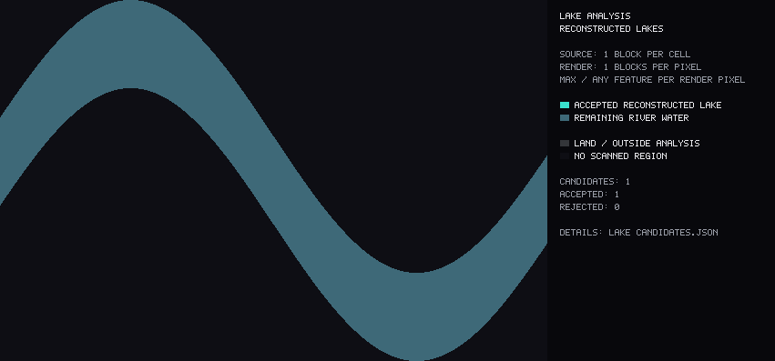

# Lake detection and diagnostics

The lake pass refines the existing retained `river`/`lake` water network at **one
block per X/Z cell**, before PNG downsampling. It changes classification only:
every retained water column still belongs to exactly one output region. It does
not add water, round shorelines, fill islands, or alter ocean temperature/depth,
swamp classification, source-water filtering, mud support, or the height cutoff.
The previous minimum-body cleanup runs first. Subsequent lake/channel boundaries
can split a retained region into smaller attribute pieces without deleting water.

## Stages

1. **Mask:** rasterize the existing RLE geometry into sparse 32x32 tiles. Keep the
   source-region index per water cell. Surface Y and water-bed Y are available
   from the scanner's existing 4x4 cells (`surface_y`, `surface_y - depth`). This
   height precision is independent of the one-block mask and distance fields.
2. **Shore distance:** multi-source Manhattan grid distance, with shore water at
   distance one. Approximate local width is twice this distance. Protected water
   handoffs and missing data bound the analysis mask. This is a grid-width
   estimate, not an exact Euclidean width; diagonals have directional bias.
3. **Density:** summed-area tables give water fractions in radius-8, radius-16
   and radius-32 square windows (17x17, 33x33 and 65x65 blocks). Fractions are
   stored as bytes and include land/missing cells in the denominator.
4. **Cores:** require shore distance and all three density tests, connect adjacent
   core cells, and reject tiny cores. Candidate width blends mean and maximum
   core radius rather than relying on total connected water area.
5. **Channels and necks:** sustained, relatively narrow medial ridges far from a
   core supply river markers. A two-sided width test and a minimum connected
   ridge span prevent stair-stepped shorelines from seeding false rivers.
   A marker-controlled flood processes shore-distance levels from wide to narrow,
   using integer priority buckets. It finds lake/channel cuts at constrictions.
   Connected cut pixels form a connection, including diagonal staircases. A neck
   is confirmed when its width is below a configurable share of its lake width.
   On constant-width channel plateaus, trace back toward the core to the first
   widening and cut the original water cross-section there. This avoids placing
   the lake exit halfway down a long uniform river between arbitrary markers.
   Check the actual water cross-section too, avoiding diagonal cuts through lake
   corners. Narrow saddles between two nearby cores retain short inter-lake rivers.
6. **Reconstruction:** flood original water from each core while respecting those
   channel cuts. Short bays and shoreline cells return; islands remain land.
   Tiny stranded bank tips (up to `min_core_area`) rejoin their single adjacent
   basin. Even shorter real channels touching two basins or protected water remain.
   Low-quality cuts remain visible in diagnostics and reduce widening confidence.
7. **Basin occupancy:** measure how much of its overall footprint the reconstructed
   candidate fills. Divide its water area by the smaller of two enclosing
   rectangles: the world-axis bounding box and a rectangle aligned with its
   principal direction (PCA). Include the full projected block squares in both
   extents. Existing lake water requires a fill ratio of at least **0.25**. A broad,
   winding river can have a confident core yet occupy little of its footprint;
   the stricter promotion gate keeps it a river. The oriented rectangle lets an elongated diagonal
   lake qualify without requiring it to fill a large world-axis rectangle. No
   water or shoreline is moved to calculate this measurement.
8. **Plausibility:** sample adjacent land above water and water heads along
   connected channels. Combine geometry, density, core support, relative widening,
   area, terrain and outlet plausibility into separate scores plus confidence.
   Uniform elongated channels without narrower connections at both longitudinal
   ends are rejected; a small side tributary alone does not make a river a lake.
9. **Conservative river promotion:** the existing biome/shape classifier supplies
   useful evidence. A candidate passing the previous stages can preserve its
   existing lake portions. Turning its river portions into lakes requires at
   least **0.50** footprint occupancy and either **0.40** core-area share or
   **0.75** occupancy. The compact-footprint alternative admits elongated lakes
   whose narrow cores occupy little of their real basin. Unseeded channels remain
   rivers. These gates affect labels only and use no annotated coordinates.
10. **Small closed bodies:** join exact four-neighbor contacts across retained
    river, lake, swamp and sea regions. A body with no path to sea and a total area
    from `min_lake_area` to **100,000** blocks receives lake labels on its inland
    portions. Swamp remains swamp. Temperature and ice seams do not split this
    area calculation; diagonal-only contacts, dry gaps and cave regions do not
    connect bodies. Larger closed networks still undergo normal segmentation.

Connectivity describes the retained source-water mask. A connection made solely
by excluded flowing water, water below the height cutoff, or unscanned chunks is
unavailable; this is not a simulation of geological drainage.

Terrain heights are lightweight 4x4 hints: the lowest valid non-water
surface-heightmap sample in each cell, including dry chunks. Accepted water and
mud are excluded so that a mixed shoreline cell retains the land's height.
Canopies and roofs can bias them, so
terrain is a confidence signal, never an absolute rejection rule. Missing terrain
gets a neutral score and a separate coverage value.

Flow directions use a measured water-head difference away from the connection.
Positive channel head is an inflow, negative is an outflow. Flat Minecraft rivers
often provide **no directional evidence**: those connections are explicitly
`unknown`, with a separate count. Zero outlets are valid, including closed lakes;
several measured outlets lower confidence without automatically rejecting a lake.
The scanner does not infer flow merely from which side of the image a river uses.

## Configuration

Use `--lake-config docs/lake-defaults.json` or a JSON file overriding any subset
of its fields. Unknown fields and invalid values fail before scanning. Defaults:

| Setting | Default | Meaning |
|---|---:|---|
| `core_radius` | 18 | Minimum one-block shore distance in a core |
| `density_8`, `density_16`, `density_32` | 0.90, 0.82, 0.80 | Required core density at each radius |
| `min_core_area` | 64 | Minimum connected core area in blocks squared |
| `min_lake_area` | 2000 | Minimum reconstructed candidate area |
| `max_closed_lake_area` | 100000 | Maximum total area of a sea-disconnected body forced to lake; 0 disables |
| `neck_width_ratio` | 0.55 | Maximum connection/lake width ratio for a confirmed neck |
| `river_seed_distance_factor` | 2.0 | Persistent-channel distance relative to core radius |
| `min_channel_length` | 32 | Minimum marker distance and connected medial-ridge span |
| `max_channel_elongation` | 8.0 | Area / maximum-width squared limit without opposed end necks |
| `min_basin_fill` | 0.25 | Minimum fitted-footprint occupancy to retain a candidate's existing lake water |
| `min_new_lake_fill` | 0.50 | Minimum footprint occupancy to promote existing river water |
| `min_new_lake_core_fraction` | 0.40 | Minimum core/candidate area share for river promotion |
| `new_lake_compact_fill` | 0.75 | Alternative occupancy evidence when the core share is smaller |
| `min_confidence` | 0.58 | Minimum combined candidate confidence |
| `terrain_rise` | 1 | Required land rise above water for positive bank evidence |
| `flow_head_difference` | 1.0 | Minimum measured head difference to infer a flow direction |
| `connection_sample_distance` | 24 | Channel sampling distance from the neck |

**For fewer false lakes inside rivers**, raise `min_new_lake_fill` or
`min_new_lake_core_fraction`. For more newly detected irregular lakes, lower
those values. Raise `min_basin_fill` only when existing lake labels also need
stronger rejection; one strict threshold for both directions discarded too many
genuine lakes in the annotated sample. Lower `max_closed_lake_area` to 20,000 or
50,000 if small landlocked meanders should remain eligible for river labels.
None of these settings smooths, adds, or deletes water. The PCA rectangle is an
approximation to the best-fitting rectangle, not an exact minimum-area rectangle.

For the previous unconditioned occupancy classifier use
`{"min_basin_fill":0.45,"min_new_lake_fill":0,"min_new_lake_core_fraction":0,"max_closed_lake_area":0}`.
Use `min_basin_fill:0` in that configuration for the earlier lake-heavy refinement.
`--no-lake-detection` bypasses the entire refinement pass.

Raise core radius or density thresholds to demand broader lake interiors. Lower
them for smaller or narrower lakes, checking that wide rivers do not become lake
cores. Lower the neck ratio to demand stronger narrowing. Change channel marker
distance cautiously: a longer distance preserves deeper bays but can extend lake
labels farther into a river. Lower area thresholds together with the existing
`--min-water-body` if small real pools should survive both stages.

## Inspecting a run

```bash
cargo run --release -- --world /path/to/world --output generated-lakes \
  --export-map --export-json --lake-debug --map-scale 8 \
  --max-below-sea-level 10 --min-water-body 2000 --min-river-merge 20000 \
  --min-sea-merge 10000 --ocean-map-min-area 10000
```

`--lake-debug` writes `debug/lakes/lake_candidates.json` and separate diagnostic
PNGs for raw inland water, width, all three densities, cores, reconstructed lakes,
necks, connection directions, and rejected candidates. The JSON retains individual
scores, acceptance/rejection reasons, bounds and connection coordinates. The
`axis_fill_ratio` and `basin_fill_ratio` fields expose occupancy before and after
the orientation adjustment; `channel_like_footprint` identifies rejection by
`min_basin_fill`. `accepts_river_water`, `core_fraction`, and `river_rejection`
expose the stricter promotion decision. `accepted_candidate_count` counts basins
eligible to retain existing lake water; `river_promotion_candidate_count` counts
those allowed to promote rivers. `closed_water` records full-body area,
sea reachability and forced-lake flags, indexed by source region position. These
technical layers do not appear on the normal combined map or add gameplay types.

The optional `lake_candidate_runs.bin` preserves exact candidate/source labels
for threshold experiments without another world scan. Its eight-byte magic is
`LKRUNS01`, followed by little-endian 20-byte records: `u32 source index`, `u32
candidate id + 1` (zero means channel), `i32 z`, `i32 x0`, `i32 x1` inclusive.
Records use raster tile order and may split at 32-block boundaries. The JSON
contains `source_kinds` and the corresponding candidate and connectivity tables.
The normal `water_regions.bin` format is unchanged.

Use `--no-lake-detection` with the same world and other arguments for an ablation
against the previous classifier. Rendering scale never changes lake decisions.
Full-resolution fields exist during analysis; diagnostic overview PNGs use the
chosen display scale. Use scale 1 for detailed pixel inspection on a small world.

Memory scales with occupied inland tiles, not the whole bounding rectangle.
Contiguous integer arrays, bounded tile lookups, flood queues and small per-worker
integral images avoid per-water-pixel maps or all-pairs comparisons. Connections
use bounded local searches. The binary water-region format and four gameplay
kinds are unchanged.

## Synthetic visual checks

These are PNGs from the actual Rust diagnostic renderer, with one block per
pixel. The confident core is deliberately smaller than the final lake:


Reconstruction reaches the original shore and leaves the channels as rivers:


The same cut logic handles diagonal river mouths:


The occupancy check keeps this broad meandering channel as river even though
it contains a confident core. Its fitted footprint is only 28% water:



Regenerate stage PNGs for round, elongated, diagonal and linked lakes, plus the
winding river, with:

```bash
cargo test export_synthetic_lake_diagnostics -- --ignored
```

Ordinary tests cover the ten requested water-network shapes, plus diagonal
mouths, short inter-lake channels, stepped water heads, bank-fragment recovery,
wide winding rivers, closed diagonal elongated lakes, protected attributes,
configuration validation and terrain evidence. Every
synthetic classification test compares the canonical original and resulting RLE
water masks and rejects overlaps.

## Sample-world validation

The final run uses the command above and the documented defaults on 2,509 region
files / 2,449,846 generated chunks. All **205 ordinary tests pass**, plus the
PNG export test (206 including that manual diagnostic check).

| Measurement | Original classifier | Previous strict occupancy | Current refinement |
|---|---:|---:|---:|
| Retained water columns | 351,359,105 | 351,359,105 | 351,359,105 |
| Sea columns | 282,357,242 | 282,357,242 | 282,357,242 |
| River columns | 31,236,411 | 36,151,591 | 31,072,058 |
| Lake columns | 29,879,633 | 24,964,453 | 30,043,986 |
| Swamp columns | 7,885,819 | 7,885,819 | 7,885,819 |
| Sea / river / lake / swamp region IDs | 148 / 955 / 1,081 / 152 | 148 / 3,677 / 1,308 / 152 | 148 / 2,665 / 1,581 / 152 |

Total region IDs decrease from 5,285 to 4,546. The lake pass finds 1,514 candidates
eligible to retain existing lake labels, of which 128 qualify to promote river
water. The closed-body rule covers 560 small bodies and 4,490,035 inland columns,
including already-lake portions. These are classification changes, not removed water.

An independent streaming comparison verifies **all 1,404,318 canonical RLE rows**,
with no differing or overlapping water columns. All 300 protected sea/swamp
regions retain identical geometry and attributes, ignoring reassigned IDs. The
ocean and depth PNGs are byte-identical to the previous classifier's output.

Canonical water-mask SHA-256:
`7eaf09570aa098208c3ca09806235eac243d06549c24dadf1b34e4342e215851`.

The analysis covers 61,116,044 inland columns in 104,566,784 allocated tile cells,
with 2,573 initial cores. Analysis takes 14.6 seconds; the full run takes 180.0
seconds, including two height-filter scans, legacy cleanup, diagnostics and
exports on the measured 24-thread machine. Short connections and inherited
attribute fragments remain valid below the earlier retention floor. Surface/bed
heights remain 4x4 estimates and flat channel water leaves flow direction unknown.

## Mask calibration

The supplied mask uses exact river/lake brush colours at the combined map's
original 4,811 x 3,200 resolution. No shifting, resizing, dilation or filling is
used. The fixed evaluation sample contains 10,142 river and 8,302 lake labels;
3,597 painted pixels over land, absent terrain, sea, swamp or the legend are
ignored. Candidate maps never choose their own evaluation sample. Missing
classifications count as errors. Scores below come from the actual exported PNGs.

| Version | River recall | Lake recall | Balanced agreement | Overall agreement |
|---|---:|---:|---:|---:|
| Original classifier | 82.96% | 74.89% | 78.92% | 79.33% |
| Lake-heavy refinement | 42.08% | 94.95% | 68.52% | 65.88% |
| Previous strict occupancy | 66.60% | 46.92% | 56.76% | 57.74% |
| Current settings | **90.49%** | **83.55%** | **87.02%** | **87.37%** |

Balanced agreement averages the two class recalls so one class cannot hide the
other. A sweep first used exact candidate-label runs with water-area majority
within each display pixel; final scoring uses the real PNG's categorical render.
Thresholds were selected on 86 of 117 whole trace groups, with 31 groups / 3,995
pixels reserved for a retrospective robustness check. That subset scores 75.41%
balanced agreement versus 63.80% for the original classifier and 57.36% for the
previous strict occupancy map. Mean agreement per trace is 83.21% for the current
map. The split occurred after annotations were seen and nearby trace pixels are
correlated: these figures describe this annotated sample, not independent
whole-world accuracy. The remaining mismatches need further examples, especially
connected irregular lakes. No annotation coordinates enter the Rust classifier.

The mask stays local. [Aggregate counts and settings](mask-calibration.json) are
published, and the optional scoring utility accepts another same-projection mask:

```bash
python -m pip install numpy pillow
python scripts/score_water_mask.py --mask /path/to/mask.png \
  --reference-map baseline/debug/water_combined_map.png \
  --reference-data baseline/water_regions.bin --map-scale 8 \
  --map generated-lakes/debug/water_combined_map.png --output mask-score.json
```

Paint river `#3ae1cd` and lake `#99cacd`; leave everything else transparent or
black. Repeat `--map` to compare versions against the same reference water.
