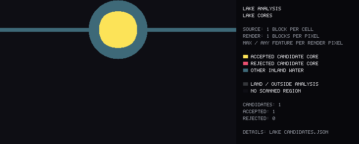
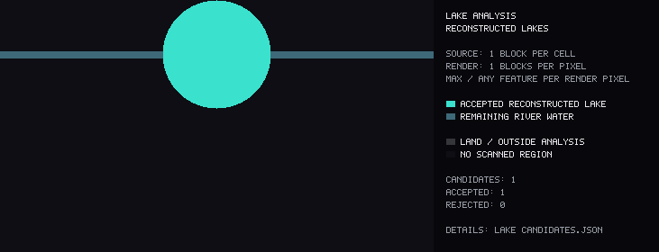
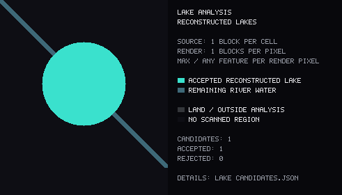

# Lake detection and diagnostics

The lake pass refines the existing retained `river`/`lake` water network at **one
block per X/Z cell**, before PNG downsampling. It changes classification only:
every retained water column still belongs to exactly one output region. It does
not add water, round shorelines, fill islands, or alter ocean temperature/depth,
swamp classification, source-water filtering, mud support, or the height cutoff.
The previous minimum-body cleanup runs first. Subsequent lake/channel boundaries
can split a retained region into smaller attribute pieces without deleting water.

## Stages

1. **Mask:** rasterize the existing RLE geometry into sparse 32x32 tiles. Keep the
   source-region index per water cell. Surface Y and water-bed Y are available
   from the scanner's existing 4x4 cells (`surface_y`, `surface_y - depth`). This
   height precision is independent of the one-block mask and distance fields.
2. **Shore distance:** multi-source Manhattan grid distance, with shore water at
   distance one. Approximate local width is twice this distance. Protected water
   handoffs and missing data bound the analysis mask. This is a grid-width
   estimate, not an exact Euclidean width; diagonals have directional bias.
3. **Density:** summed-area tables give water fractions in radius-8, radius-16
   and radius-32 square windows (17x17, 33x33 and 65x65 blocks). Fractions are
   stored as bytes and include land/missing cells in the denominator.
4. **Cores:** require shore distance and all three density tests, connect adjacent
   core cells, and reject tiny cores. Candidate width blends mean and maximum
   core radius rather than relying on total connected water area.
5. **Channels and necks:** sustained, relatively narrow medial ridges far from a
   core supply river markers. A two-sided width test and a minimum connected
   ridge span prevent stair-stepped shorelines from seeding false rivers.
   A marker-controlled flood processes shore-distance levels from wide to narrow,
   using integer priority buckets. It finds lake/channel cuts at constrictions.
   Connected cut pixels form a connection, including diagonal staircases. A neck
   is confirmed when its width is below a configurable share of its lake width.
   On constant-width channel plateaus, trace back toward the core to the first
   widening and cut the original water cross-section there. This avoids placing
   the lake exit halfway down a long uniform river between arbitrary markers.
   Check the actual water cross-section too, avoiding diagonal cuts through lake
   corners. Narrow saddles between two nearby cores retain short inter-lake rivers.
6. **Reconstruction:** flood original water from each core while respecting those
   channel cuts. Short bays and shoreline cells return; islands remain land.
   Tiny stranded bank tips (up to `min_core_area`) rejoin their single adjacent
   basin. Even shorter real channels touching two basins or protected water remain.
   Low-quality cuts remain visible in diagnostics and reduce widening confidence.
7. **Plausibility:** sample adjacent land above water and water heads along
   connected channels. Combine geometry, density, core support, relative widening,
   area, terrain and outlet plausibility into separate scores plus confidence.
   Uniform elongated channels without narrower connections at both longitudinal
   ends are rejected; a small side tributary alone does not make a river a lake.

Terrain heights are lightweight 4x4 hints: the lowest valid non-water
surface-heightmap sample in each cell, including dry chunks. Accepted water and
mud are excluded so that a mixed shoreline cell retains the land's height.
Canopies and roofs can bias them, so
terrain is a confidence signal, never an absolute rejection rule. Missing terrain
gets a neutral score and a separate coverage value.

Flow directions use a measured water-head difference away from the connection.
Positive channel head is an inflow, negative is an outflow. Flat Minecraft rivers
often provide **no directional evidence**: those connections are explicitly
`unknown`, with a separate count. Zero outlets are valid, including closed lakes;
several measured outlets lower confidence without automatically rejecting a lake.
The scanner does not infer flow merely from which side of the image a river uses.

## Configuration

Use `--lake-config docs/lake-defaults.json` or a JSON file overriding any subset
of its fields. Unknown fields and invalid values fail before scanning. Defaults:

| Setting | Default | Meaning |
|---|---:|---|
| `core_radius` | 18 | Minimum one-block shore distance in a core |
| `density_8`, `density_16`, `density_32` | 0.90, 0.82, 0.80 | Required core density at each radius |
| `min_core_area` | 64 | Minimum connected core area in blocks squared |
| `min_lake_area` | 2000 | Minimum reconstructed candidate area |
| `neck_width_ratio` | 0.55 | Maximum connection/lake width ratio for a confirmed neck |
| `river_seed_distance_factor` | 2.0 | Persistent-channel distance relative to core radius |
| `min_channel_length` | 32 | Minimum marker distance and connected medial-ridge span |
| `max_channel_elongation` | 8.0 | Area / maximum-width squared limit without opposed end necks |
| `min_confidence` | 0.58 | Minimum combined candidate confidence |
| `terrain_rise` | 1 | Required land rise above water for positive bank evidence |
| `flow_head_difference` | 1.0 | Minimum measured head difference to infer a flow direction |
| `connection_sample_distance` | 24 | Channel sampling distance from the neck |

Raise core radius or density thresholds to demand broader lake interiors. Lower
them for smaller or narrower lakes, checking that wide rivers do not become lake
cores. Lower the neck ratio to demand stronger narrowing. Change channel marker
distance cautiously: a longer distance preserves deeper bays but can extend lake
labels farther into a river. Lower area thresholds together with the existing
`--min-water-body` if small real pools should survive both stages.

## Inspecting a run

```bash
cargo run --release -- --world /path/to/world --output generated-lakes \
  --export-map --export-json --lake-debug --map-scale 8 \
  --max-below-sea-level 10 --min-water-body 2000 --min-river-merge 20000 \
  --min-sea-merge 10000 --ocean-map-min-area 10000
```

`--lake-debug` writes `debug/lakes/lake_candidates.json` and separate diagnostic
PNGs for raw inland water, width, all three densities, cores, reconstructed lakes,
necks, connection directions, and rejected candidates. The JSON retains individual
scores, acceptance/rejection reasons, bounds and connection coordinates. These
technical layers do not appear on the normal combined map or add gameplay types.

Use `--no-lake-detection` with the same world and other arguments for an ablation
against the previous classifier. Rendering scale never changes lake decisions.
Full-resolution fields exist during analysis; diagnostic overview PNGs use the
chosen display scale. Use scale 1 for detailed pixel inspection on a small world.

Memory scales with occupied inland tiles, not the whole bounding rectangle.
Contiguous integer arrays, bounded tile lookups, flood queues and small per-worker
integral images avoid per-water-pixel maps or all-pairs comparisons. Connections
use bounded local searches. The binary water-region format and four gameplay
kinds are unchanged.

## Synthetic visual checks

These are PNGs from the actual Rust diagnostic renderer, with one block per
pixel. The confident core is deliberately smaller than the final lake:



Reconstruction reaches the original shore and leaves the channels as rivers:



The same cut logic handles diagonal river mouths:



Regenerate all stage PNGs for round, elongated, diagonal and linked lakes with:

```bash
cargo test export_synthetic_lake_diagnostics -- --ignored
```

Ordinary tests cover the ten requested water-network shapes, plus diagonal
mouths, short inter-lake channels, stepped water heads, bank-fragment recovery,
protected attributes, configuration validation and terrain evidence. Every
synthetic classification test compares the canonical original and resulting RLE
water masks and rejects overlaps.

## Sample-world validation

The final run uses the command above and the documented defaults on 2,509 region
files / 2,449,846 generated chunks. All **191 ordinary tests pass**, plus the
separately invoked PNG export test.

| Measurement | Previous classifier | Lake refinement |
|---|---:|---:|
| Retained water columns | 351,359,105 | 351,359,105 |
| Sea columns | 282,357,242 | 282,357,242 |
| River columns | 31,236,411 | 12,025,434 |
| Lake columns | 29,879,633 | 49,090,610 |
| Swamp columns | 7,885,819 | 7,885,819 |
| Sea / river / lake / swamp region IDs | 148 / 955 / 1,081 / 152 | 148 / 4,474 / 1,938 / 152 |

An independent streaming comparison verifies **all 1,404,318 canonical RLE rows**,
with no differing or overlapping water columns. All 300 protected sea/swamp
regions retain identical geometry and attributes, ignoring reassigned IDs. The
ocean and depth PNGs are byte-identical to the previous classifier's output.

Canonical water-mask SHA-256:
`7eaf09570aa098208c3ca09806235eac243d06549c24dadf1b34e4342e215851`.

The analysis covers 61,116,044 inland columns in 104,566,784 allocated tile cells,
accepting 1,521 of 2,573 cores. Analysis takes 12.1 seconds; the full run takes
163.8 seconds (including two height-filter scans, legacy cleanup, diagnostics and
exports). Peak process working set is 3.09 GiB on the measured 24-thread machine.

These measurements verify geometry and implementation behavior, not accuracy
against manually labelled hydrological ground truth. Broad connected rivers can
still require stricter core/density settings for a particular world. The new
transitions increase region count: short connections and inherited attribute
fragments remain valid below the earlier retention floor. Use the region-ID and
rejected-candidate maps to inspect them, or `--no-lake-detection` to reproduce the
previous classifier. Surface/bed heights remain 4x4 estimates and flat channel
water leaves flow direction unknown.
